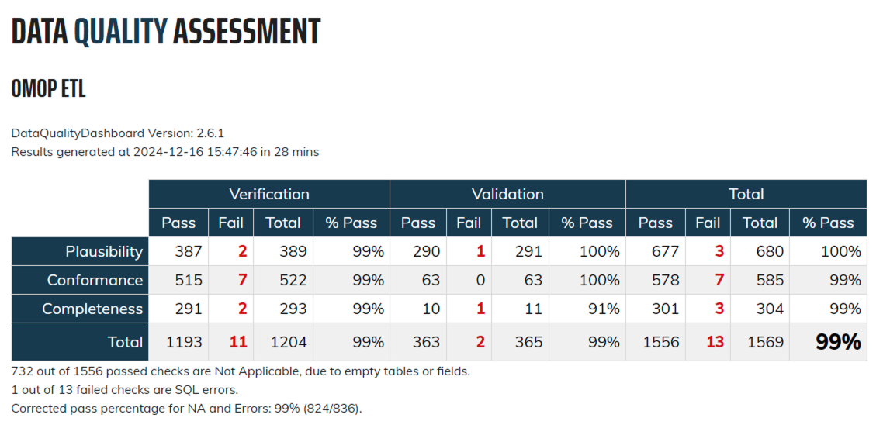

# MedicareLDS2OMOP_ETL
Release date: Jan 9, 2025

This project referenced previous [works](https://github.com/OHDSI/ETL-CMS/tree/master) done by OHDSI and contains the source code to convert the Medicare LDS to .csv files suitable for loading into an OMOP Common Data Model v5.3 database.

Medicare Limited Data Sets (LDS) are de-identified datasets provided by the Centers for Medicare & Medicaid Services (CMS) for research purposes. These datasets contain detailed healthcare information but exclude direct identifiers to protect privacy. We
anticipate that this resource will be useful for researchers in
developing OHDSI tools, as well as serve as a testbed for the analysis
of observational health records.

More details can be found [here]([https://github.com/OHDSI/ETL-CMS/blob/master/python_etl/README.md](https://github.com/Danielyaoan/MedicareLDS2OMOP_ETL/blob/main/python_etl/README.md)).

## What's in Here?

### python_etl
A complete Python-based ETL of the Medicare LDS data into CDMv5-compatible CSV
files. See the [README.md](https://github.com/Danielyaoan/MedicareLDS2OMOP_ETL/blob/main/python_etl/README.md) file therein for detailed instructions for
running the ETL, as well as creating and loading the data into a CDMv5 database.

### RabbitInAHat
The [WhiteRabbit/RabbitInAHat](https://ohdsi.github.io/WhiteRabbit/RabbitInAHat.html) files used to develop the ETL specification, along with an out-of-date ETL specification in DOCX format.

### DataQualityDashboard
The assessment results derived from OHDSI DQD.

### Additional Resources
- [CMS-SynPuf-ETL-CDM](https://github.com/OHDSI/ETL-CMS/tree/master) convert the public Centers for Medicare & Medicaid Services (CMS) Data Entrepreneurs' Synthetic Public Use File (DE-SynPUF) to .csv files suitable for loading into an OMOP Common Data Model v5.2 database.

